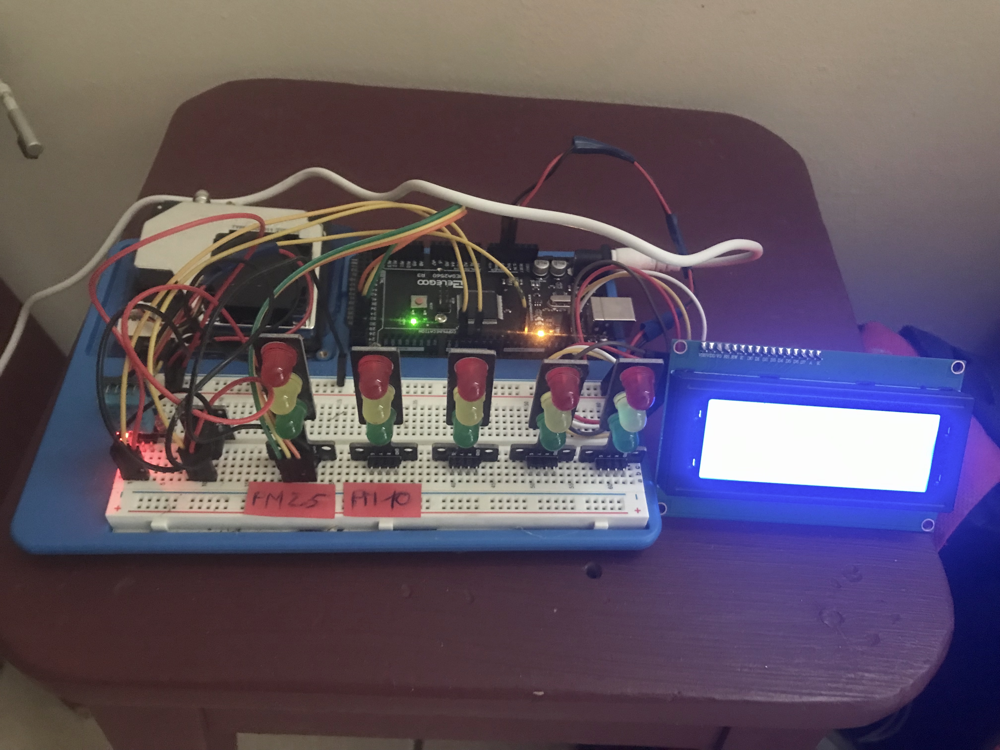

  # DIY AIR QUALITY MONITOR – PM2.5, CO2, VOC, OZONE, TEMP & HUM ARDUINO METERe

Have you ever wondered about the quality of the air you are breathing, or maybe, why you sometimes feel sleepy in the office or tired in the morning even after sleeping all night? Poor air quality can lead to many negative health effects as well as can cause tiredness, headaches, loss of concentration, increased heart rate and so on. Monitoring the quality of the air may actually be more important than you realize. So, in this tutorial we will learn how to build our own Air Quality Monitor which is capable of measuring PM2.5, CO2, VOC, Ozone, as well as temperature and humidity..

